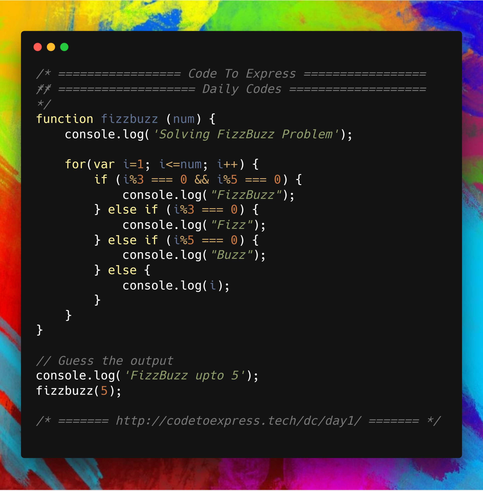

# [Fizz Buzz Problem](https://medium.com/code-to-express/daily-codes-day-1-the-classical-fizzbuzz-problem-346abe09101c)

Write a program that prints the numbers from 1 to 100 and for multiples of ‘3’ print “Fizz” instead of the number and for the multiples of ‘5’ print “Buzz”.

Read Full Problem Here: [Fizz Buzz](https://medium.com/code-to-express/daily-codes-day-1-the-classical-fizzbuzz-problem-346abe09101c)


## [JavaScript implementation](./fizzbuzz.js)

```js
function fizzbuzz (num) {
    console.log('Solving FizzBuzz Problem');         

    for(var i=1; i<=num; i++) {
        if (i%3 === 0 && i%5 === 0) {
            console.log("FizzBuzz");
        } else if (i%3 === 0) {
            console.log("Fizz");
        } else if (i%5 === 0) {
            console.log("Buzz");
        } else {
            console.log(i);
        }
    }
}

// Guess the output
console.log('FizzBuzz upto 5');
fizzbuzz(5);
```



## [C implementation](./fizzbuzz.c)

```c
#include<stdio.h>

int main(void) {
    int i;

    for(i=1 ; i<101 ; i++) {
        if(i%15 == 0)
            printf("\nFizzBuzz ");
        else if(i%5 == 0)
            printf("\nBuzz ");
        else if(i%3 == 0)
            printf("\nFizz ");
        else
            printf("\n%d ", i);   
    }

    return 0;
}
```

## [C++ implementation](./fizzbuzz.cpp)

```cpp
#include<iostream>

using namespace std;

int main()
{
    int i;
    for(i=1;i<=100;i++)
    {
        if( (i%5==0) && (i%3==0) )
        {
            cout<<"FizzBuzz"<<endl;
        }
        else if(i%5 == 0)
        {
            cout<<"Buzz"<<endl;
        }
        else if(i%3 == 0)
        {
            cout<<"Fizz"<<endl;
        }
        else
        {
            cout<<i<<endl;
        }
    }

    return 0;
}

```


## [Python implementation](./fizzbuzz.py)

```python

# fizzbuzz function
def fizzbuzz(n):
    if(n%15 == 0):
        print('FizzBuzz')
    elif(n%5 == 0):
        print('Buzz')
    elif(n%3 == 0):
        print('Fizz')
    else:
        print(n)

# main function
if __name__=='__main__':
    for i in range(0,101):
        fizzbuzz(i)
        
```