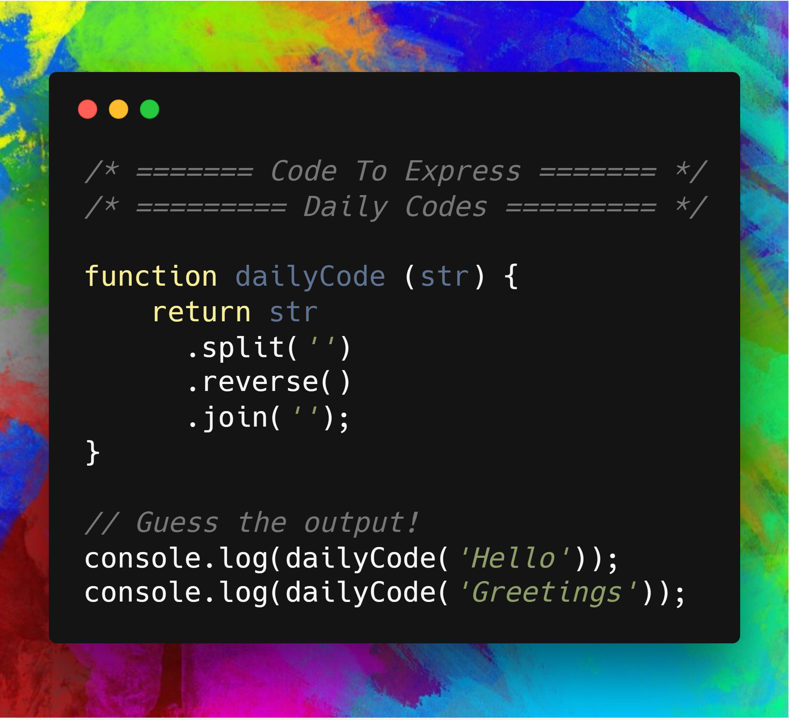

# String Reversal


## [JavaScript Implementation](./strRev.js)

```js
function dailyCode (str) {
    return str
      .split('')
      .reverse()
      .join('');
}

// Guess the output!
console.log(dailyCode('Hello')); 
console.log(dailyCode('Greetings')); 
```



## [Python Implementation](./strRev.py)

```python
def strRev(a):
    return a[::-1]

stringList=['Hello','Greetings']
stringRevList=[strRev(i) for i in stringList]

# Guess the output!
for i in stringRevList:
    print(i)
```

## [C Implementation](./strRev.c)

```c
// strRev Function
void strRev( char str[MAX] ) {
    int i;
    int j;
    char temp;

    for(i=0 ; str[i]!='\0' ; i++);

    j=0;
    i = i-1;

    while(j<i) {
        temp = str[j];
        str[j] = str[i];
        str[i] = temp;
        j++;
        i--;
    }
    printf("The reversed string is %s", str);
}

// main Function
int main(void) {
    char string[MAX];

    printf("Enter the string: ");
    gets(string);
    strRev(string);
    return 0;
}
```

## [C++ Implementation](./strRev.cpp)

```cpp
#include<iostream>

using namespace std;

// Reversing Function
string strRev(const string& s)
{
    static string temp=s;
    int k=0;
    for(int i=s.size()-1;i>=0;i--)
    {
        temp[k++]=s[i];
    }
    return temp;
}

// main function
int main()
{
    string s="Hello";
    string rev=strRev(s);
    cout<<rev<<endl;
    return 0;
}
```